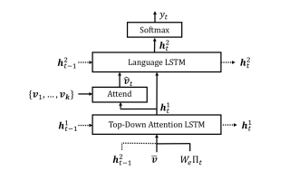
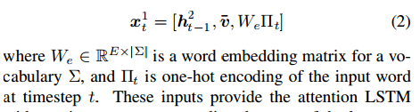
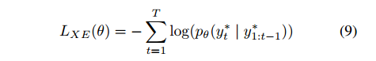

# [code](http://www.panderson.me/up-down-attention)

##创新

1. 我认为最主要的创新是是用了两个LSTM网络来完成图像描述的任务(Top dwon)。
2. 没有是用全部的图像特征，而是先通过一个Faster Rcnn来进行object detection ,根据一些阈值来选去特征，然后才输入lstm(Bootom up)

##  Bootom up  Attention Model
* 使用Fater Rcnn + Resnet101在ImageNet上进行预训练，然后在visual genome上进行训练
* 增加属性预测，将提取的每一个object box的特征与 gt object class 的embedding连接，然后输入到另外一个输出层，由softmax预测
    每一个类别属性，还要对每一个类别的属性增加一个 “no attributes”类
* Attention机制只是通过一些阈值（预测的置信度，框的大小）来选择一些object

## Caption Model

* 两个LSTM:TOP-Down Attention LSTM   Language LSTM
### TOP-Down Attention LSTM: 通过LSTM t时刻出的ht来对每一个选出的object box feature 计算权重，然后将乘以权重的特征作为第二个LSTM的个输入   
输入： Language LSTM t-1时刻的输出、所有object box feature 的均值、和先前产生单词的encoding  
  
然后通过ht计算一个权重（具体方法见论文，很简单就是进行了一个tanh）,将图像特征与权重相乘再相加，得到Language LSTM的输入图像特征  
* 计算的这个权重就是attention机制  

### Language LSTM
根据上面所述产生的图像特征以及ht来预测产生单词

## 损失函数 (最小化  t-1时刻的gt单词 根据网络参数产生t时刻单词 的交叉熵 )

其中y*是gt 单词

