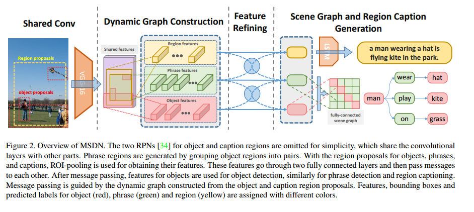
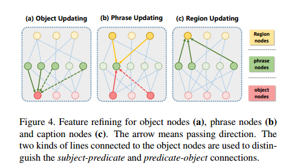
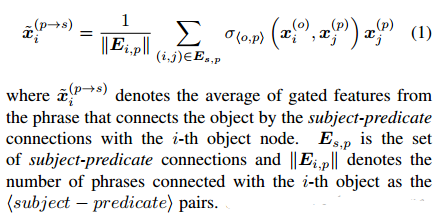
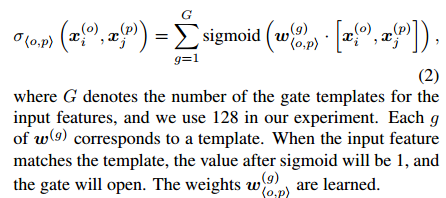
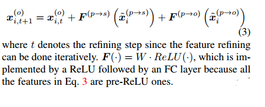

# [code](https://github.com/yikang-li/MSDN)
## 创新
* 将三个不同层级的视觉(object dection, scene graph,image caption )任务结合起来进行端到端训练
* 进行了不同程度的特征融合，object dection节点的特征融合，短语节点与object dection节点的特征融合，image caption 与短语节点的特征融合
## 缺点
* 产生出来的scene graph并没有用于产生image caption

## 步骤
### step1：Region Proposal
object proposal: RPN网络
phrase region proposal : 两两object 节点连接
caption region: RPN网络
### step2: Feature Speclization
对于不同层级的任务对应着不同的特征
通过ROI Pooling 然后对每一层级的任务接一个1024维的全连接层
### Dynamic Graph Construction
短语与object节点的结构图通过每个object节点互相连接建立，每个phrase proposal连接两个物体，<subject-predicate-object>
caption proposal图建立：当一个caption proposal 与 phrase proposal 的fraction超过一个阈值（论文0.7）的时候就建立一个无向边连接

### Feature Refining
通过融合三个任务的特征来进行精调
#### Refine Feature of Object(phrase proposal and object proposal):
对于每个object node都有两种连接 <subject predicate>,<predicate-object>
根据不同的连接将phrase feature 特征划分为两个不同的集合，然后通过合并的特征进行refine object features
#### phrase feature merge
不同的短语节点在对object refiner时重要性不同，所以设计一个权重（以 subject-predicate 为例,相同方法可以得到predicate-object）

* 开始对object features 进行refine

增加了一个全连接，实现modality transformation

