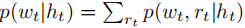
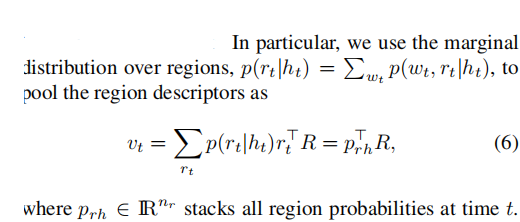
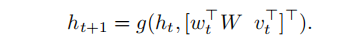
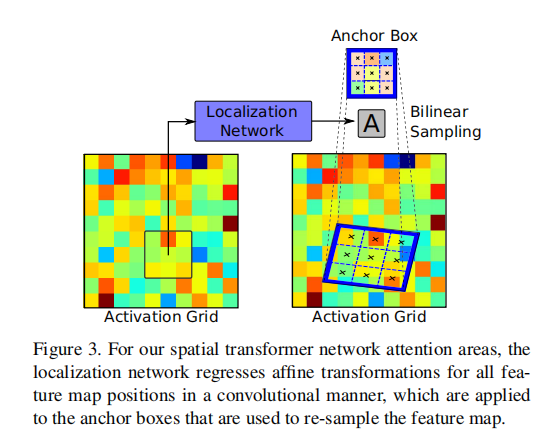

# [论文]（./papper/areas_of_attention_for_image_captioning.pdf）
## 创新
1. 相比于之前的attention机制，作者提出了一个新的attention机制，不仅可以考虑图像于RNN中state，同时也考虑图像区域与单词，状态
之间的两两关系（也有在单词与图像区域间交换信息的，但都是离线学习，即先训练好一个目标监测网络，为本文方法是用一个弱监督的方法实现
目标监测，而且整个网络是end to end 的）。
2. 应用了 spatial_transfromer_networks
## attention 机制
原来的image caption是将图像在初始化的时候作为rnn的初始值，而本文提出的方法是在产生每个单词的时候输入图像的不同区域
1.对单词和图像区域进行打分，然后利用边缘概率密度函数就算下一单词的分布
2.建立了一个联合概率密度函数 p(wt,rt|ht),wt是t时刻的单词，rt为t时刻关注的区域，ht是RNN内部状态
  边缘概率密度函数p(wt|ht)预测下一个单词，p(rt|ht)用来提供visual feedback，用于RNN state 更新，rt是一个one-hot，表示t时刻的
  image region的index
   
   第一个score ：word-state
   第二个score ：words 与 region 的兼容性
   第三个score ：状态与图像之间的联系
   后两个相当于偏置
给定一个RNN的state，使用边缘概率密度来预测下一个单词   
除了利用image regions作为条件预测单词，还使用image region更新RNN state
    在描述与image region之间建立一个连接用于state更新
    
    

## Areas of attention
### activation grid
将特征图划分为z= x*y个，通道数为c，每个块对应一个描述。
### object proposal
使用目标监测的方法将目标提取出来，然后利用RPN-Pooling将目标缩放到统一尺寸，对于一些较小的物体使用separate cnn进行操作
### spatial transformers
没有bounding box 标签，所以需要一个特殊的机制进行反向传播（论文并没有细说）
对特征图上的每一个目标框进行一个仿射变换：

location function 包含两个卷积层，去计算一个仿射变换A。
对每一个目标框对应一个anchors box （对目标框进行卷积得到），对anchor box 进行仿射变换，然后再双线性插值。
由于没有bounding box 标签，所以在最小化损失函数的时候会无法进行反向传播，为了解决这个问题，先利用activation grid训练
一个网络，然后在添加上仿射变换。

