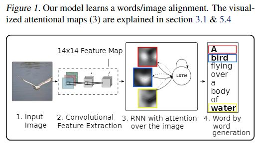
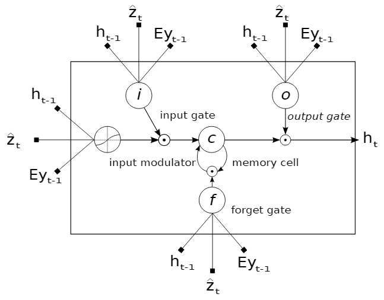
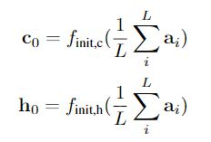
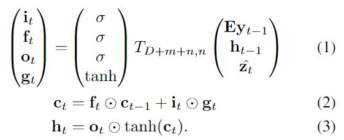
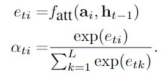
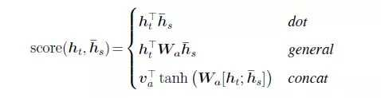
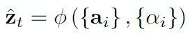
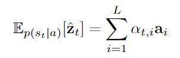

# [参考]（https://zhuanlan.zhihu.com/p/32333802）
## 创新
在decoder 的基础上加入了attention机制  hard 与 soft
在进行选择特征图时，没有利用全联接层，而是使用VGG最后一层的卷积输出的结果
hard attention是只关注图像的一部分，其余的地方去掉
soft atttion是对图像不同的区域学习一个权重

## 基础框架
### Encoder :VGG
1. 经过VGG后输出14x14x512
2. Flatten后为196x512,L=196 D=512 称为 annotation vectors
a = {a1,....al} ai是D维
3. 在t时刻，对每个位置分配一个权重，然后相加，就得到了这个特征图在t时刻的表示Zt
### Deocder：LSTM

#### lstm隐藏层与cell层的初始化

将196个annoation vectors求均值，然后分别通过两个独立的MLP

1. Eyt-1为上一时刻的输出的文字对应的词向量
2. ht-1为上一时刻的隐藏层的输出
3. Zt是t时刻的特征图的attention表示，因为每个时刻的关注点是不一样的，所以attention的权重是和decode
的上一时刻的隐藏层有关的
4. m是词向量的维度，n是LSTM的维度

Ti,j 是向量映射
## attention权重：

* 其中fatt是一种对齐模型，常见的对齐方式有(本文使用了第三种)：

5. 得到Zt:

## 两个不同的attention机制
### hard attention
其核心是随机采样灾这些区域中进行选择。
### soft attention
对每个向量(表示不同的区域)分配一个权重，然后相加最后得到一个一维的向量

