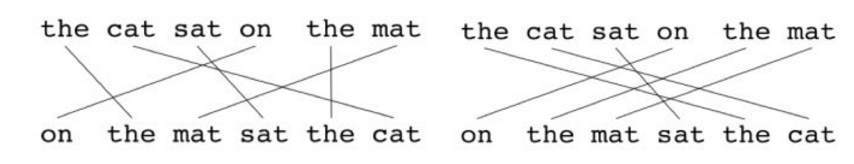
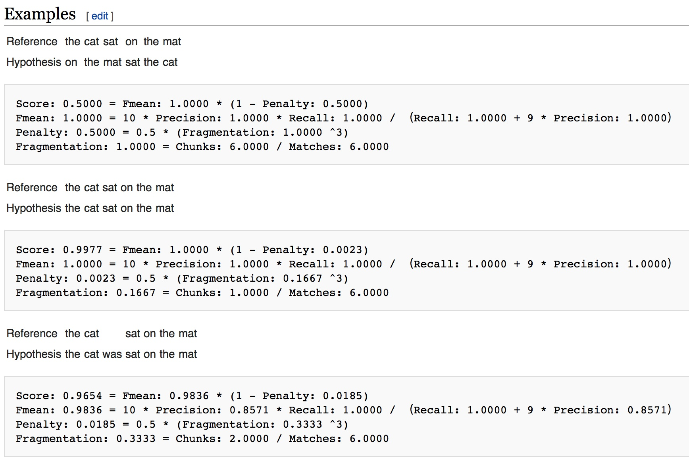
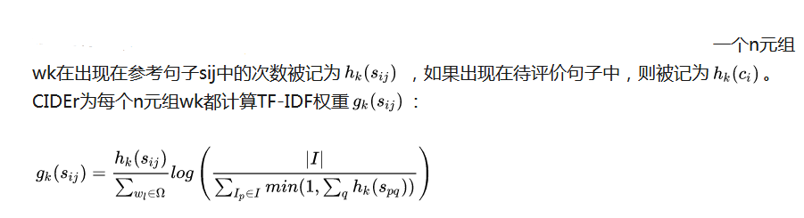
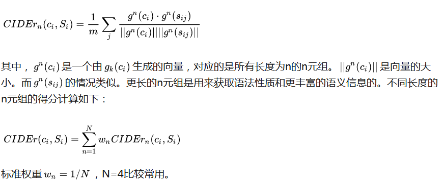
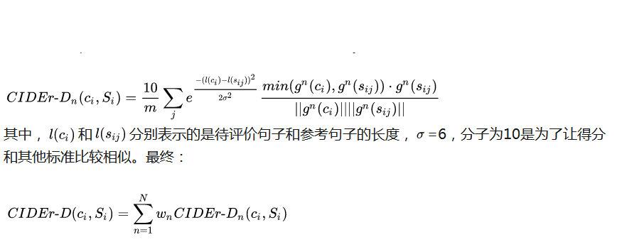
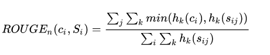
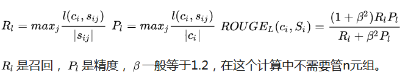

* 现在的评价标准都是基于N-gram的也就是n个单词进行评价
## Perolexity
    在rnn中生成每个单词的置信度的log和，再取均值的相反数  ，代表着困惑度，也就是说在生成每个单词时置信度越高,Perolexity就会越低，困惑度越小
## BLEU（基于准确率的评测）
1. 将句子以n-gram分开，然后计算这几个分开的块同时出现在gt中的个数
    eg:
        gt: the cat is on the mat
        pre: the the the the the the
    n =1，这种情况分开的the全部出现在了gt的句子中，所以精度是 5/5 =1 ，所以下面进行了改进
2. 为了解决上述问题
    将预测的句子c以n-gram分开，先计算每个块在c中出现的次数Count(n-gram)，然后统计在每个gt句子中出现的最大值，将该值与
    Count(n-gram)中最小的 计做n-gram的匹配次数Countclip(n-gram) 之后把每个n-gram累加起来
    pre = ∑ Countclip(n-gram) /∑  Count(n-gram)
     eg:
        gt1: the cat is on the mat
        gt2: ther is a cat on the mat
        pre: the the the the the the
        在gt中出现的最大值是2 ，count(the) = 5 ,所以精度是2/5
3. 但是这样还有问题，会偏好较短的句子，比如预测的句子是gt的前几个单词，那么用前面的方法得分是1，所以要对较短的句子惩罚
    假设gt给出的句子长度是12,15,17，预测的是12，那么就不进行惩罚(BP=1)，只比较长度最相近的。
    BP = {1, lc > ls
          exp(1- ls / lc) , lc <= ls }

    最终BLEU = BP * exp(∑(w * log p)) \\      w 取1/N ，表示n-gram 中 ，n由1到4的均值

## Meteor (用来评价机器翻译输出的标准)
    * 该方法基于“一元组”的精度和召回的调和平均
    精度： P = m/wt       m表示在预测得句子和gt句子中同时出现的词 在 预测的句子中出现的次数 ，wt表示预测的句子中一元组的数量
    召回率：R = m / wr    m同上，wr表示Gt中一元组出现的数量
    调和平均来计算F-mean ：
        F = (10 * P * R)/ (R + 9P)
    上述方法并没有对更大的分段进行衡量，使用更长的n元组来计算对于平面的惩罚p，在预测的句子与gt的句子中没有毗邻的映射链接越多，惩罚就越高
    
    惩罚P计算如下： p = 0.5(c/u)^3   ,c 就是块的数量(连着对应的算一个块)，u是被映射的一元组的数量
    最后： M = (1 - p)F
    

## CIDEr  专门用于图像标注问题的
它是通过对每个元组进行Term Frequency Inverse Document Frequency(TF-IDF)权重计算，来衡量图像标注一致性的

Ω表示所有n元组的词汇表，I表示所有图像的集合
公式的第一个部分计算的是每个n 元组出现gt中的频率，如果出现频率越高，权重就会越大
公式第二个部分是用IDF来计算n元组的稀有程度，对那些经常出现的单词，但是对视觉内容信息没有多大帮助的单词的重要性打折（基于 对视觉重要性的单词
不会每个句子都出现很多次）

###CIDEr-D 使得CIDEr对gaming问题更鲁棒（一个句子人工判断得分很低，但是在自动计算标准中得分却很高）
为了解决上述问题，CIDEr增加了截断和基于长度的高斯惩罚

## ROUGE (是用来评价文本摘要算法)
### ROUGE-N  就是简单计算一个n元组的召回率

### ROUGE-L (一个基于最长公共子序列的算法)
两个句子间的最长公共子序列长度记为l(ci,sij)

### ROUGE-S (使用跳跃二元组，即跳跃二元组是句子中有序的单词对)
比如一个句子有四个单词，那么就有6种跳跃二元组

